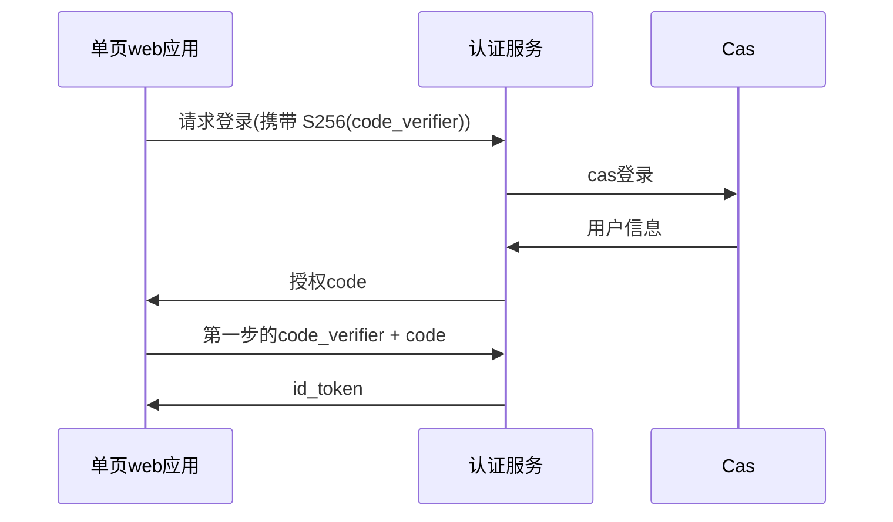
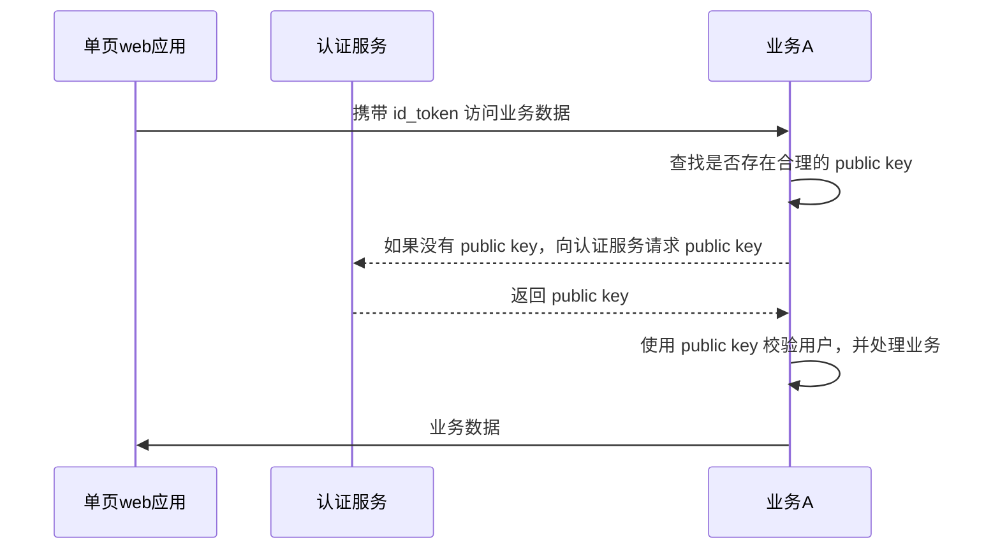

# Micro Auth OIDC

基于 PKCE 流程的轻量权限控制模块

我们推荐使用第三方开源的 OIDC 认证服务，如 logto, keycloak, casdoor, zitadel 等, 并在 Web 单页应用中认证获取 id_token, 然后在后端验证 token 有效性。

## 配置

```properties
jmicro.jwt.oidc[0].matcher-style=prefix
# 这将匹配 /custom-oidc-key/*** 的 kid 使用 openid-configuration 获取 public key
jmicro.jwt.oidc[0].pattern=custom-oidc-key/
jmicro.jwt.oidc[0].openid-configuration=https://your-oidc-server/oidc/.well-known/openid-configuration
```

## Cas

这是我们在某次开发中遇到的问题时的处理方案，Cas 服务的登录状态在 Java 应用中，但我们的前端基本都是单页应用，所以我们需要考虑如何在单页中获取登录状态，可能的方案有将单页应用放入到 java 应用中，但这个方案会将 java 应用和前端在构建阶段耦合，不优雅，所以当我看到 PKCE 时，这或许是一个更好的方案，具体流程如下

登录流程



在业务系统中的使用流程



这个服务默认是关闭的，启用后，我们会在该应用中实现一个简化版的 oidc 服务
